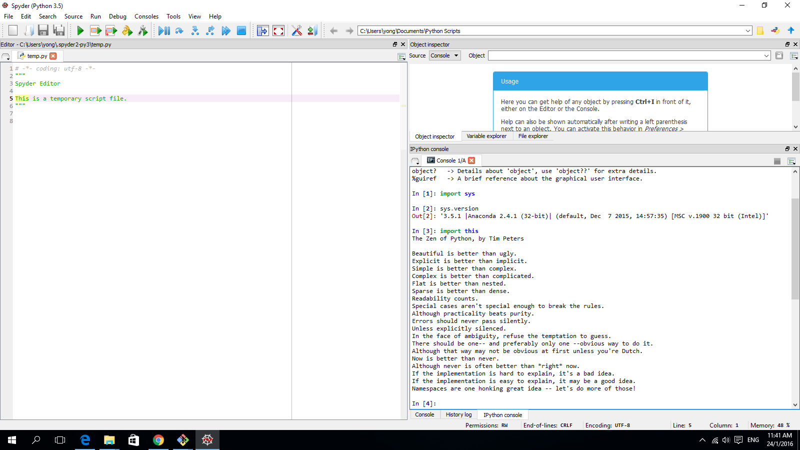

UECM3033 Assignment #1 Report
========================================================

- Prepared by: ** Yong Jun Ting**
- Tutorial Group: T3

--------------------------------------------------------

## Task 1 -- setup a github repository

The reports, codes and supporting documents are uploaded to Github at: 

[https://github.com/JuntingYong/UECM3033_assign1.git]

---------------------------------------------------------

## Task 2 -- setup python

Put here the screen shot of file (python.png)

------------------------------------------------------------

## Task 3 -- modify and run Python script

In this section, please report:

1. The hexadecimal value of your student ID.
    0x155e30

2. Write down the definite integrals that you have chosen.
    $$\int_0^{\pi} e^{x} {\sin} (2x) dx = -\frac{{2}}{5}(e^{\pi}-1).$$

3. Write down your system of 10 linear equations.
\begin{align*}
5x_0 + 7x_1 + 6x_2 + 9x_3 + 6x_4 + 21x_5 +15x_6-16x_7+ 26x_8+3x_9&= 470,\\
8x_0 + 6x_1 + 9x_2 + 13x_3 + 7x_4 + 8x_5 +1x_6-5x_7+ 20x_8+8x_9&= 409,\\
4x_0 + 1x_1 -7x_2 + 5x_3 -5x_4 -9x_5 +4x_6+11x_7+ x_8+2x_9&= 71,\\
-8x_0 + 12x_1 -x_2 + 2x_3 + 6x_4 + 9x_5 +7x_6+12x_7+ 33x_8-9x_9&= 457,\\
15x_0 + 4x_1 + 2x_2 + x_3 -8x_4 -12x_5 +3x_6+27x_7-5x_8-8x_9&= 33,\\
9x_0 + 7x_1 + 8x_2 + 4x_3 + 4x_4 + 8x_5 +7x_6+26x_7+ 4x_8+13x_9&= 554,\\
5x_0 + 9x_1 + 7x_2 -7x_3 -6x_4 + 8x_5 +24x_6+27x_7+ 27x_8+8x_9&= 741,\\
4x_0 + 16x_1 + 26x_2 + 3x_3 + 5x_4 + 7x_5 +17x_6+5x_7+ 7x_8+21x_9&= 625,\\
7x_0 - 6x_1 + 18x_2 + 1x_3 + 1x_4 + 2x_5 +4x_6+8x_7+ 8x_8+7x_9&= 304,\\
4x_0 -8x_1 + 21x_2 + 8x_3 + 2x_4 + 12x_5 -1x_6+2x_7+ 5x_8+8x_9&= 299.\\
\end{align*}

Here are the examples of how to add equations in markdown:

$$\int_0^{\infty} e^{-x^2} dx = \frac{\sqrt{\pi}}{2}.$$

\begin{align*}
3 x_0 +x_1 &= 9,\\
x_0 + 2 x_1 &= 8.
\end{align*}

-----------------------------------

last modified: 27/01/2016
